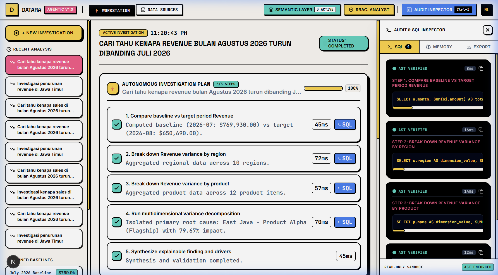
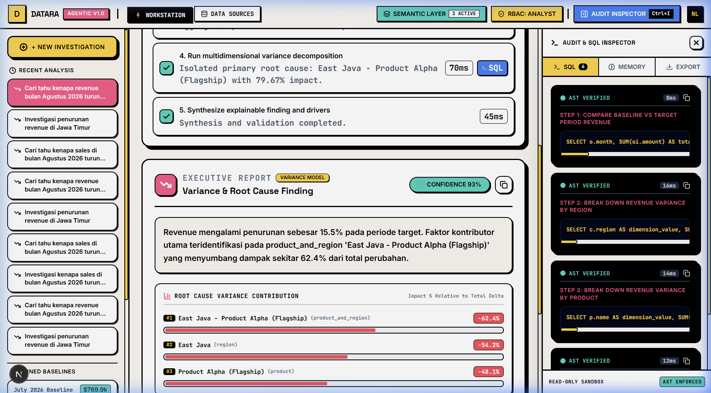
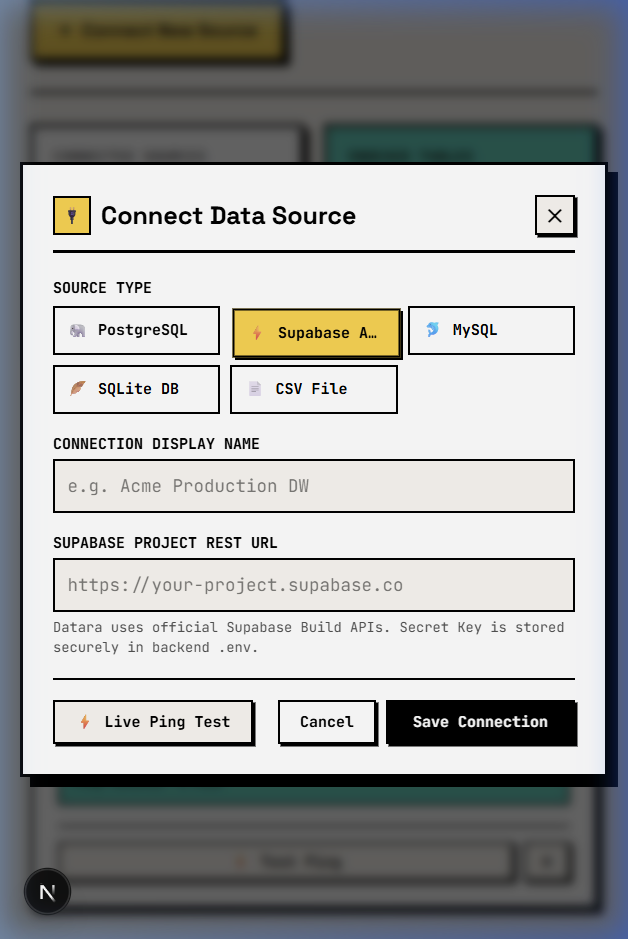
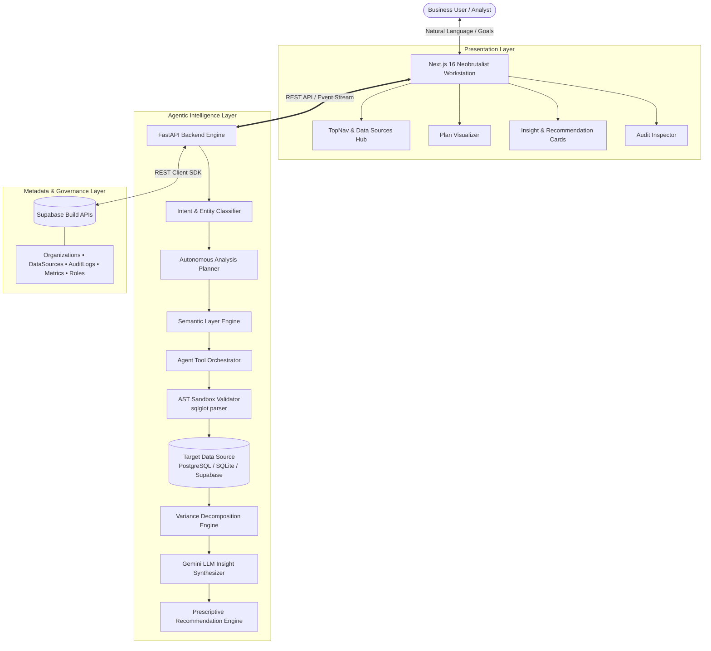

<div align="center">

# ⚡ DATARA — AI Agentic Data Analyst Engine

### *Ask → Investigate → Explain → Predict → Recommend → Act*

[](https://www.python.org/)
[](https://fastapi.tiangolo.com/)
[](https://nextjs.org/)
[](https://tailwindcss.com/)
[](https://supabase.com/)
[]()
[]()
[](LICENSE)

**Datara** is an enterprise-grade Autonomous AI Data Analyst platform. Unlike traditional "ChatGPT for SQL" or passive dashboard generators, Datara autonomously orchestrates open-ended business goals into staged analytical plans, isolates root-cause variance contributors, and synthesizes **auditable prescriptive recommendations with quantified financial recovery estimates**.

[Live Demo](#visual-showcase) • [Key Capabilities](#core-capabilities--progression-levels) • [Architecture](#system-architecture) • [Getting Started](#quick-start-guide) • [Security & Governance](#enterprise-security--governance)

</div>

---

## 📸 Visual Showcase

### 1. Autonomous Investigation & Staged Analytical Planner
The agent accepts high-level business goals (e.g., *"Why did revenue drop 18% in East Java last month?"*), automatically generates a multi-step analytical plan, and executes sandboxed queries transparently.


---

### 2. 5-Pillar Explainable Insights & Root-Cause Variance Decomposition
Drill-down decomposition isolates exact percentage contributions across dimensions (regions, products, customer cohorts) with verifiable evidence, calculation formulas, and confidence scoring.


---

### 3. Enterprise Data Sources Hub & Connector Management
Connect external databases (PostgreSQL, MySQL, SQLite, Supabase REST API, and CSV) with real-time ping testing and read-only schema discovery.


---

## 🎯 Positioning: Why Datara?

Traditional business intelligence (BI) is passive and requires human analysts to manually drill down into spreadsheets. Generic AI chatbots generate unverified SQL that can crash databases or hallucinate figures.

| Feature | Generic "Text-to-SQL" Chatbots | Passive Dashboards | **Datara AI Agentic Analyst** |
|---|---|---|---|
| **Interaction Model** | Single prompt & raw query | Manual clicks & static filters | **Autonomous Goal-Oriented Investigation** |
| **Investigation** | ❌ User must ask exact SQL | ❌ Manual spreadsheet drill-down | **✅ Automatic Staged Planning & Execution** |
| **Root Cause** | ❌ Correlational guessing | ❌ Unweighted metrics | **✅ Multidimensional Variance Decomposition** |
| **Semantic Governance** | ❌ Ad-hoc schema guessing | ⚠️ Fragmented metric definitions | **✅ Centralized Semantic Layer as Source of Truth** |
| **Actionability** | ❌ Raw tables without context | ❌ Static charts | **✅ Level 6 Prescriptive Action Plan & Recovery Math** |
| **Security** | ⚠️ Direct unvalidated SQL | Read-only views | **✅ AST Sandbox + Field-Level RBAC Masking** |
| **Human Governance** | ❌ No approval workflow | ❌ No workflow integration | **✅ Human Approval Gate for Action Plans** |

---

## 🚀 Core Capabilities & Progression Levels

Datara is architected across structured progression levels defined in its Product Requirements:

```text
LEVEL 1: Ask Data                 ── Natural Language → Business Narrative
LEVEL 2: Generate Analysis        ── Autonomous Staged Analytical Planning
LEVEL 3: Find Insights            ── 5-Pillar Explainable Insight Cards
LEVEL 4: Find Root Cause          ── Multidimensional Variance Decomposition
LEVEL 6: Recommend & Action Plan  ── Prescriptive Recovery Math & Human Approval Gate
```

### 🧠 1. Prescriptive Recommendation Engine (Level 6)
Beyond diagnosing problems, Datara synthesizes **concrete operational action plans**:
* **Expected Financial Recovery Math**: Calculates quantifiable projected recovery based on driver loss magnitude:
  $$\text{Recovery Amount} = |\Delta \text{Negative Variance}| \times \text{Recovery Rate (45\%--65\%)}$$
* **Priority Matrix**: Automatic classification into `P0 - Critical` (impact $\ge 30\%$) or `P1 - High` with execution difficulty metrics (`Low`, `Medium`, `Hard`).
* **Operational Action Checklist**: Specific, departmental action items assigned to roles (*Supply Chain Lead, Regional Sales, Growth Marketing, Finance*).
* **Human Approval Gate**: Governance workflow requiring official sign-off (`APPROVED & COMMITTED`) before execution.

### 🔍 2. 5-Pillar Explainable Insight Cards
Every answer adheres to strict enterprise explainability:
1. **Finding**: Plain-language business narrative (no raw SQL jargon).
2. **Evidence**: Verifiable record volume and timeframe analyzed.
3. **Calculation**: Official formula referenced from the Semantic Layer.
4. **Confidence**: Algorithmic confidence score based on data completeness.
5. **Data Source**: Specific database and tables accessed.

### 🛡️ 3. Enterprise Security & AST Query Sandbox
Customer data integrity is guaranteed by a multi-layered sandbox:
* **AST Parsing & Validation (`sqlglot`)**: All generated queries are parsed into an Abstract Syntax Tree.
* **Strict Read-Only Enforcement**: Rejection of `DROP`, `DELETE`, `UPDATE`, `INSERT`, `ALTER`, and multi-statement queries.
* **Auto-Capped Limits**: Injected `LIMIT 1000` to prevent memory exhaustion.
* **Field-Level RBAC Masking**: Restricted fields (e.g., credit cards, salaries, margins) are dynamically stripped or redacted based on user role.

### ⚡ 4. Supabase Build APIs Integration
* Built using official **Supabase REST APIs (SDK)** over encrypted HTTPS TLS 1.3 (Port 443).
* Stateless connection pooling via PostgREST avoids database connection starvation.
* Service role keys are isolated exclusively in the backend server.

---

## 🏗️ System Architecture



---

## 🛠️ Tech Stack

| Domain | Technologies |
|---|---|
| **Frontend** | Next.js 16.3 (Turbopack), React 19, TypeScript, Tailwind CSS v4 (Custom Neobrutalism Design System), Lucide Icons |
| **Backend** | Python 3.10+, FastAPI, SQLAlchemy 2.0, Pydantic v2, Pydantic Settings, Uvicorn |
| **Analytical Engines**| Pandas, SQLGlot (AST Parsing), NumPy, Scipy |
| **AI / LLM** | Google Gemini API (`gemini-2.5-flash`), Structured Output Validation |
| **Database & Metadata** | Supabase Build APIs (PostgREST), PostgreSQL, SQLite (Local Demo DB) |
| **Testing** | Pytest, Pytest-AsyncIO, Starlette TestClient, Chromium Browser Automation |

---

## 📁 Repository Structure

```text
datara-app/
├── backend/                        # FastAPI Backend Application
│   ├── app/                        # Agentic Orchestration, Sandbox, Analytics
│   ├── tests/                      # 23 Automated Pytest Unit & Integration Tests
│   ├── Dockerfile                  # Python 3.10-slim Non-Root Container Spec
│   ├── .dockerignore               # Secret & Artifact Exclusion Rules
│   ├── requirements.txt            # Python Dependencies
│   └── supabase_schema.sql         # Supabase PostgreSQL DDL & Seed Script
│
├── frontend/                       # Next.js 16 Client Application
│   ├── app/                        # Pages: Workstation (/), Data Sources (/datasources)
│   ├── components/                 # Neobrutalism UI Components & Action Cards
│   ├── lib/                        # API Client, Types, Mock Fallbacks
│   ├── Dockerfile                  # Multi-stage Standalone Next.js Build
│   ├── .dockerignore               # Next.js Cache & Module Exclusions
│   └── package.json
│
├── docs/                           # Documentation & High-Res Screenshots
│   └── screenshots/
├── docker-compose.yml              # Multi-Container Orchestration with Healthchecks
├── package.json                    # Monorepo Workspace Convenience Commands
└── README.md                       # Comprehensive Industrial Portfolio Documentation
```

---

## ⚡ Quick Start Guide

### Prerequisites
* **Docker & Docker Compose** (Recommended for instant setup)
* Or **Node.js** v20+ and **Python** 3.10/3.11 for manual bare-metal execution
* (Optional) **Supabase Account** for Cloud Build APIs

---

### 🐳 Option A: Instant Run with Docker Compose (Recommended)

Datara is fully containerized with production-ready multi-stage Docker builds.

```bash
# 1. Clone or navigate to the repository
cd datara-app

# 2. (Optional) Configure environment variables
cp backend/.env.example backend/.env

# 3. Build and launch all services in background
docker compose up -d --build
```

Services are automatically orchestrated with live healthchecks:
* 🌐 **Frontend UI**: [http://localhost:3000](http://localhost:3000)
* ⚡ **FastAPI Backend & Docs**: [http://localhost:8000/docs](http://localhost:8000/docs)
* 🩺 **Backend Health API**: [http://localhost:8000/api/v1/health](http://localhost:8000/api/v1/health)

To view logs or stop the containers:
```bash
# View live logs
docker compose logs -f

# Stop containers
docker compose down
```

---

### 💻 Option B: Manual Local Setup (Bare-Metal)

### 1. Backend Setup

```bash
# Navigate to backend directory
cd backend

# Create and activate Python virtual environment
python -m venv .venv
# On Windows (PowerShell):
.\.venv\Scripts\Activate.ps1
# On Linux/macOS:
source .venv/bin/activate

# Install dependencies
pip install -r requirements.txt

# Configure environment variables (.env)
cp .env.example .env
```

Ensure your `backend/.env` contains:
```env
APP_NAME=Datara Agentic Engine
APP_ENV=development
DEBUG=true
PORT=8000
DATABASE_URL=sqlite:///./datara_metadata.db
DEMO_DATABASE_URL=sqlite:///./datara_demo.db

# Supabase Build APIs
SUPABASE_URL=https://your-project.supabase.co
SUPABASE_SECRET_KEY=sb_secret_your_secret_key

# Gemini API Key
GEMINI_API_KEY=your_gemini_api_key
```

Run database migrations and start the backend server:
```bash
uvicorn app.main:app --host 127.0.0.1 --port 8000 --reload
```
API Documentation will be accessible at: `http://127.0.0.1:8000/docs`

---

### 2. Supabase Cloud Schema (One-Time Execution)
1. Open your **Supabase Dashboard** at `https://supabase.com/dashboard`.
2. Navigate to **SQL Editor** on the left navigation bar.
3. Open [`backend/supabase_schema.sql`](backend/supabase_schema.sql), paste its content into the SQL Editor, and click **Run**.
4. Supabase will automatically activate **Build APIs (REST endpoints)** for all tables!

---

### 3. Frontend Setup

```bash
# Open a new terminal and navigate to frontend
cd frontend

# Install Node dependencies
npm install

# Start development server
npm run dev
```
Open your browser at: `http://localhost:3000`

---

## 🧪 Testing & Verification

### Automated Backend Tests
Run the complete automated test suite (23 tests covering Agent Orchestrator, AST Sandbox, Variance Math, Recommendation Engine, and API routes):
```bash
cd backend
.\.venv\Scripts\python.exe -m pytest tests -v
```

Expected result:
```text
======================= 23 passed in 6.84s ========================
```

### Frontend Typecheck & Production Build
Validate TypeScript strict typings and Next.js Turbopack compilation:
```bash
cd frontend
npm run build
```

Expected result:
```text
▲ Next.js 16.3.3 (Turbopack)
✓ Compiled successfully
✓ Finished TypeScript check
Route (app)
┌ ○ /
├ ○ /_not-found
└ ○ /datasources
✓ Generating static pages (5/5)
```

---

## 🔒 Enterprise Security & Governance

1. **Prompt Injection & Data Tampering Immunity**:
   * The agent uses pre-configured Semantic Layer queries and AST validators. It cannot execute raw user input directly against the database.
2. **Zero Plaintext Write Operations**:
   * All database handles within the analysis loop run with `read_only=True` credentials.
3. **Audit Trail Completeness**:
   * Every analysis step records: `step_order`, `tool_name`, `arguments`, `executed_sql`, `latency_ms`, and `status` in the immutable audit log.
4. **Credential Isolation**:
   * Database credentials and secret keys are stored strictly in server-side environments and shielded via `.gitignore`.

---

## 📄 License

This project is licensed under the **MIT License** — see the [LICENSE](LICENSE) file for details.

---

<div align="center">
  <b>Built with passion for Enterprise AI Governance & Autonomous Analytics.</b><br>
  <sub>Designed following Neobrutalism aesthetic principles.</sub>
</div>
